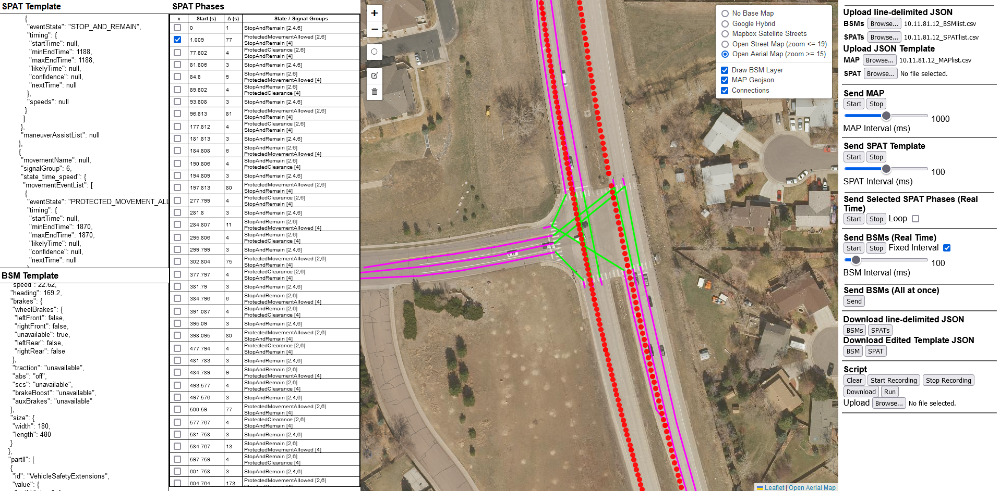
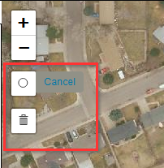

# Test Message Sender

This is a UI that can send test BSM JSON messages to the Conflict Monitor using a map interface and create test scripts to be run with script runner.

## Configuration

Copy the file `src/main/resources/application.properties.example` to a new file named `application.properties` in the same directory.

Fill in the property `mapbox.tile.endpoint` with a Mabox tile endpoint (obtained from Mapbox Studio > Styles > Share... > Developer Resources > Third party > Integration URL) with the following format:
```
https://api.mapbox.com/styles/v1/[USERNAME]/[STYLEID]/tiles/{z}/{x}/{y}?access_token=[ACCESSTOKEN]
```
## Prerequesites
* USDOT ODE
* USDOT ODE Geojson Converter

### ODE

1) Download the ODE source code from [USDOT JPO ODE](https://github.com/usdot-jpo-ode/jpo-ode)

2) Build the ODE libraries. Run:

```bash
$ mvn clean install
```

from the base jpo-ode directory to make the ODE libraries available in the local maven repository.

3) Run the ODE in Docker according to the instructions at [ODE Installation](https://github.com/usdot-jpo-ode/jpo-ode#installation):
```bash
$ docker-compose up --build -d
```

### ODE Geojson Converter

1) Download the ODE Geojson converter from [USDOT JPO ODE Geojsonconverter](https://github.com/usdot-jpo-ode/jpo-geojsonconverter) according to the instructions on that site.
2) Check out the `develop` branch
3) Build the geojson converter libraries.  Run:
```bash
$ mvn clean install
```
from the jpo-geojsonconverter directory to install the geojson converter library in the local maven repository.

4) Run the Geojson converter in Docker via:
```bash
$ docker-compose up --build -d
```

## Compile and Run

Kafka must be running locally, and the "topic.OdeBsmJson" topic must have been created.  Then start up this application by running the following from the `test-message-sender/message-sender` directory:

```bash
$ mvn clean package
$ mvn spring-boot:run
```

And navigate to `http://localhost:8088/` in a browser.

## Usage

Message Sender / Script Creator Map UI:



The UI enables doing the following things:

* Upload line-delimited ODE JSON files containing BSM or SPAT data.
* Upload JSON files containing MAP or SPAT data to use as templates.  The MAP is displayed on the map.  The SPAT phases are listed in a table.
* Send the MAP template to the OdeMapJson topic at a configurable interval.
* Send the SPAT template to the OdeSpatJson topic at a configurable interval.
* Select a combination of SPAT phases to send to the topic in real time, once or looped.
* Send an uploaded BSM path, or a custom path created with the UI, to the OdeBsmJson topic in real time (optionally with a configurable fixed interval), or all at once.
* Download line-delimited JSON for BSMs and SPATs, or JSON files containing the edited BSM or SPAT templates.
* Record scripts containing real-time SPAT, MAP, and BSM data.

### Create a BSM Path

Using the drawing controls:



* Select the circle marker button to place BSMs on the map.

* Select Cancel when finished placing BSMs.

* Use the trash icon > "Clear All" to delete the entire path.

* The BSMs can be sent to the topic, or downloaded as line-delimited JSON.

* Editing points after placing them or deleting individual points are not supported.


